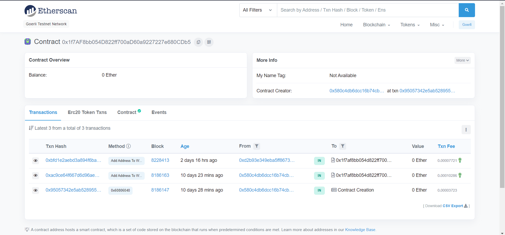

# Whitelist-dapp
## LearnWeb3DAO Shophomore track first project deployment
**This apps basic purpose is to whitelist the addresses for our eary user to have some of our NFTs from the NFT Collection (building) its a project from LearnWeb3DAO's Sophomore track**
The app is has been deployed in goerli test-net with the 
**Address :-** `0x1f7AF8bb054D822ff700aD60a9227227e680CDb5`
**Etherscan tx's link :-** [click here](https://goerli.etherscan.io/address/0x1f7AF8bb054D822ff700aD60a9227227e680CDb5)

### Deployment

The app is deployed using vercel deploymant and you can use it [dapps link](https://whitelist-dapp-bide-7izd740u0-startup-dreamer.vercel.app/)
